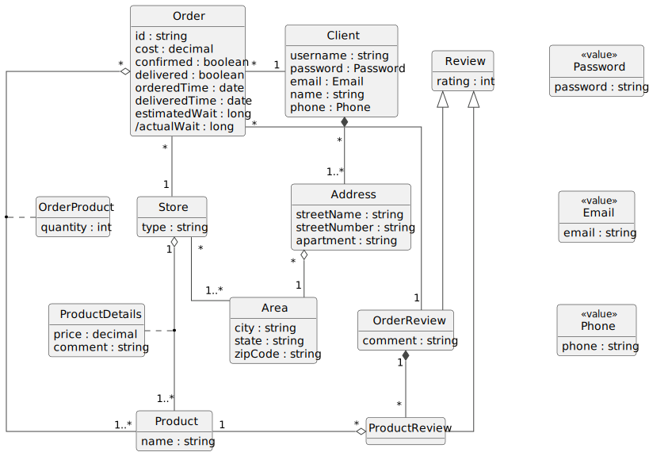

# Σύστημα διανομής παραγγελιών φαγητού

Το παρόν αποθετήριο περιέχει την προγραμματιστική εργασία του μαθήματος
«Προηγμένες μέθοδοι ανάπτυξης λογισμικού» του ΠΜΣ στην Ανάπτυξη & Ασφάλεια
Πληροφοριακών Συστημάτων του Οικονομικού Πανεπιστημίου Αθηνών, για το
ακαδημαϊκό έτος 2022-2023, με θέμα ένα σύστημα διανομής παραγγελιών φαγητού.

Η ομάδα αυτής της εργασίας αποτελείται από τους εξής φοιτητές:
- Κακάβας Αχιλλέας (@axill12)
- Σομός Ιωάννης (@ObserverOfTime)

## Περιγραφή

Το σύστημα θα υποστηρίζει **παραγγελία** φαγητού από διάφορα **καταστήματα**
(ταβέρνες, ψητοπωλεία, πιτσαρίες κτλ.) μέσω ενός ενιαίου καταλόγου.
Κάθε κατάστημα θα εξυπηρετεί συγκεκριμένες **περιοχές** οι οποίες θα
πρέπει να δηλώνονται στο σύστημα από τον διαχειριστή του καταστήματος.
Κάθε κατάστημα θα προσαρμόζει τον ενιαίο κατάλογο επιλέγοντας τα **είδη**
που προσφέρει, τις τιμές τους καθώς και ένα προαιρετικό σύντομο σχόλιο
για κάθε προσφερόμενο είδος. Οι **πελάτες** έχουν δυνατότητα επιλογής
των ειδών προς παραγγελία και το σύστημα εμφανίζει τα καταστήματα που
μπορούν να την εξυπηρετήσουν βάσει καταλόγου και γεωγραφικής εμβέλειας.
Επιπλέον, παρέχει δυνατότητα σύγκρισης των παραγγελιών για
επιλεγμένα καταστήματα από τα αποτελέσματα αναζήτησης.

Ο πελάτης μετά την εγγραφή (ή σύνδεσή) του στο σύστημα επιλέγει και
υποβάλλει την παραγγελία σε συγκεκριμένο κατάστημα. Η παραγγελία
επιβεβαιώνεται μέσω SMS μετά από σύντομο χρονικό διάστημα. Το SMS
θα περιλαμβάνει το κόστος της παραγγελίας και τον εκτιμώμενο χρόνο
παράδοσης. Μετά την παράδοση της παραγγελίας ο χρήστης μπορεί να
**αξιολογήσει** το κατάστημα βάσει του χρόνου εξυπηρέτησης της παραγγελίας
αλλά και να εισάγει επιμέρους βαθμολογία για κάθε είδος της παραγγελίας.
Ο διανομέας επιβεβαιώνει την παράδοση κάθε παραγγελίας προκειμένου
να είναι δυνατή η παραγωγή στατιστικών στοιχείων απόδοσης.

Το σύστημα θα υπολογίζει κατάλληλα στατιστικά τα οποία
απευθύνονται στους υπεύθυνους των καταστημάτων εστίασης όπως:
* Πελάτες με περισσότερες παραγγελίες ανά χρονική περίοδο.
* Μέσος χρόνος παράδοσης παραγγελίας ανά περιοχή εξυπηρέτησης.
* Ώρες αιχμής (ώρες κατά τις οποίες ο αριθμός παραγγελιών είναι
  μεγαλύτερος από ένα συγκεκριμένο όριο) για δεδομένη εβδομάδα.

### Παραδοχές

* Ο πελάτης μπορεί να έχει μόνο μία διεύθυνση.
* Ο κωδικός παραγγελίας είναι ένα ψευδοτυχαίο αλφαριθμητικό.
* Η γενική αξιολόγηση παραγγελίας μπορεί να περιέχει
  κάποιο σχόλιο και επιμέρους αξιολογήσεις προϊόντων.
* Η βαθμολογία παίρνει τιμές από `0` έως `5`.
* Η πληρωμή γίνεται μόνο κατά τη παράδοση.
* Το σύστημα εξυπηρετεί μόνο την Ελλάδα επομένως:
  - Το νόμισμα είναι πάντα ευρώ.
  - Οι διευθύνσεις είναι ελληνικές.
  - Οι τηλεφωνικοί αριθμοί είναι ελληνικοί.
* Οι τιμές στρογγυλοποιούνται στα δύο δεκαδικά ψηφία.
* Το διαμέρισμα μπορεί να περιλαμβάνει όροφο και αριθμό.

### Λειτουργίες

#### Εγγραφή χρήστη

* Ο χρήστης εισάγει τα στοιχεία του.
* Το σύστημα ελέγχει τα εξής στοιχεία:
  - Το username δεν χρησιμοποιείται ήδη από άλλον χρήστη.
  - Το username πρέπει να αποτελείται μόνο από αλφαριθμητικούς
    χαρακτήρες, `_`, `-`, ή `.` και να έχει μήκος έως 20 χαρακτήρες.
  - O κωδικός πρόσβασης πρέπει να περιέχει τουλάχιστον 8 χαρακτήρες.
  - Η διεύθυνση email και ο αριθμός τηλεφώνου πρέπει να είναι έγκυροι.
* Αν οποιοσδήποτε έλεγχος αποτύχει, εμφανίζεται το σφάλμα στον
  χρήστη και του δίνεται η δυνατότητα να επανεισάγει τα στοιχεία.
* Όταν οι έλεγχοι ολοκληρωθούν επιτυχώς, η εγγραφή οριστικοποιείται.

#### Σύνδεση χρήστη

* Ο χρήστης εισάγει το username και τον κωδικό πρόσβασης.
* Το σύστημα ελέγχει αν υπάρχει το username που εισήγαγε ο χρήστης.
* Επίσης ελέγχει αν ο κωδικός πρόσβασης αντιστοιχεί στον χρήστη.
* Αν οποιοσδήποτε έλεγχος αποτύχει, εμφανίζεται το σφάλμα στον
  χρήστη και του δίνεται η δυνατότητα να επανεισάγει τα στοιχεία.
* Όταν οι έλεγχοι ολοκληρωθούν επιτυχώς, ο χρήστης συνδέεται στο σύστημα.

#### Παραγγελία

* Ο πελάτης περιηγείται τον κατάλογο και επιλέγει είδη
  προς παραγγελία καθώς και την ποσότητα του κάθε είδους.
* Το σύστημα του εμφανίζει τα καταστήματα που μπορούν να
  εξυπηρετήσουν την παραγγελία λαμβάνοντας υπόψη αν διαθέτουν
  τα επιλεγμένα είδη και αν εξυπηρετούν την περιοχή του πελάτη.
* Δίνει τη δυνατότητα στον πελάτη να συγκρίνει τις παραγγελίες
  για τα επιλεγμένα καταστήματα από τα αποτελέσματα αναζήτησης.
* Ο πελάτης επιλέγει κάποιο κατάστημα και υποβάλλει την παραγγελία.
* Το σύστημα αποθηκεύει τον χρόνο υποβολής της παραγγελίας.
* Έπειτα στέλνει SMS στον πελάτη το οποίο περιέχει τον κωδικό
  παραγγελίας, το κόστος και τον εκτιμώμενο χρόνο παράδοσης.
* Μόλις η παραγγελία παραδοθεί στον πελάτη, εκείνος καταβάλλει
  το κόστος της και το σύστημα αποθηκεύει τον χρόνο παράδοσης.

#### Αξιολόγηση παραγγελίας

* Μετά την ολοκήρωση της παραγγελίας, δίνεται η δυνατότητα στον
  πελάτη να αξιολογήσει το κατάστημα βάσει του χρόνου εξυπηρέτησης.
* Μπορεί να συνοδέψει τη βαθμολογία του καταστήματος με κάποιο σύντομο σχόλιο.
* Επίσης, μπορεί να βαθμολογήσει και κάθε προϊόν της παραγγελίας ξεχωριστά.

#### Εγγραφή καταστήματος

* Ο διαχειριστής καταχωρεί το όνομα και τον τύπο του καταστήματος.
* Επιπλέον, δηλώνει τις περιοχές που εξυπηρετεί το κατάστημα.
* Ακόμα, επιλέγει τα προϊόντα που προσφέρει και τις τιμές τους
  καθώς και (προαιρετικά) ένα σύντομο σχόλιο για το κάθε προϊόν.

#### Παραγωγή στατιστικών

* Το σύστημα υπολογίζει τα εξής στατιστικά στοιχεία για το κάθε κατάστημα:
  - Πελάτες με περισσότερες παραγγελίες ανά χρονική περίοδο.
  - Μέσος χρόνος παράδοσης παραγγελίας ανά περιοχή εξυπηρέτησης.
  - Ώρες με μεγαλύτερο αριθμό παραγγελιών από κάποιο όριο ανά εβδομάδα.
* Τα στατιστικά αυτά μπορεί να τα δει ο διαχειριστής του καταστήματος.

### Περιορισμοί

* H επιβεβαίωση παραγγελίας θα εμφανίζεται χωρίς να αποστέλλεται SMS.
* Στην εγγραφή δεν γίνεται κάποια επιβεβαίωση στο email ή το τηλέφωνο.
* Δεν υπάρχει δυνατότητα ανάκτησης του κωδικού πρόσβασης του χρήστη.

## Μοντέλο πεδίου

